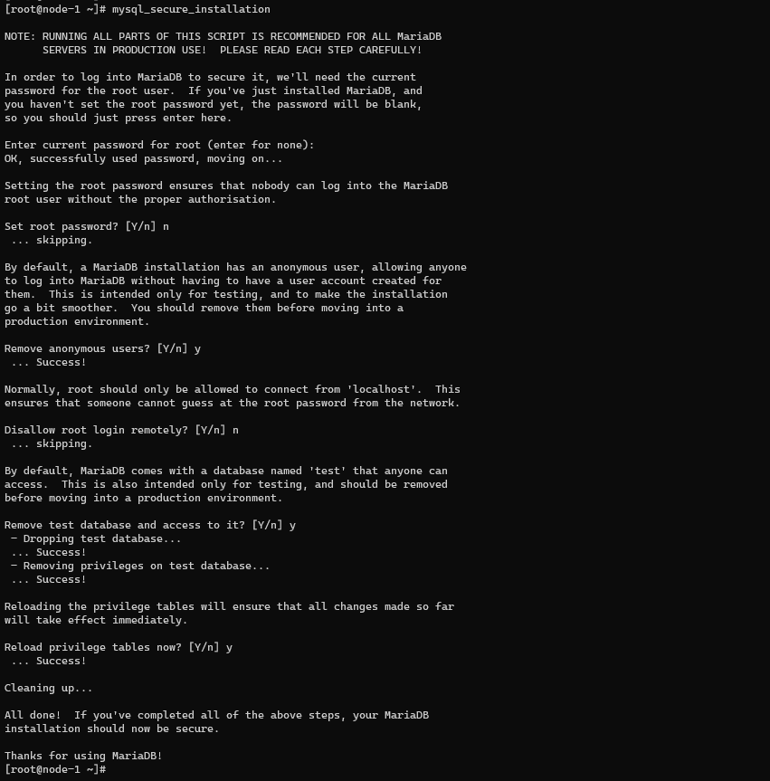

### Menu
- [1. Mô hình master-slave](#1)  
- [2. Cài đặt mariadb](#2)  
- [3. Config server master](#3)  
- [4. Config server slave-1](#4)  
- [5. Config server slave-2](#5)  
- [6. Check replication](#6)  

### 1. Mô hình master-slave
    Master IP : 10.0.0.11
    Slave-1 IP  : 10.0.0.12
    Slave-2 IP  : 10.0.0.13

### 2. Cài đặt mariadb (Tất cả các node)
    yum install mariadb-server mariadb -y
    service mariadb restart
    mysql_secure_installation

    n
    y
    n
    y
    y

### 3. Config server master: 10.0.0.11
- Config: /etc/my.cnf.d/cluster.cnf

        touch /etc/my.cnf.d/cluster.cnf
        cat <<EOF>> /etc/my.cnf.d/cluster.cnf
        [mysqld]
        server-id=1
        relay-log = /var/lib/mysql/mysql-relay-bin
        relay-log-index = /var/lib/mysql/mysql-relay-bin.index
        log-error = /var/lib/mysql/mysql.err
        master-info-file = /var/lib/mysql/mysql-master.info
        relay-log-info-file = /var/lib/mysql/mysql-relay-log.info
        log-bin = /var/lib/mysql/mysql-bin
        EOF
- Start service mariadb:

        service mariadb restart
- Config mysql on master:

        mysql
        grant replication slave on *.* to repl@'10.0.0.12' identified by '1';
    

### 4. Config server slave: 10.0.0.12
- Config: /etc/my.cnf.d/cluster.cnf

        touch /etc/my.cnf.d/cluster.cnf
        cat <<EOF>> /etc/my.cnf.d/cluster.cnf
        [mysqld]
        server-id=2
        relay-log = /var/lib/mysql/mysql-relay-bin
        relay-log-index = /var/lib/mysql/mysql-relay-bin.index
        log-error = /var/lib/mysql/mysql.err
        master-info-file = /var/lib/mysql/mysql-master.info
        relay-log-info-file = /var/lib/mysql/mysql-relay-log.info
        log-bin = /var/lib/mysql/mysql-bin
        EOF
- Start service mariadb:

        service mariadb restart
- Config mysql mysql slave-1

        mysql
        stop slave;
        CHANGE MASTER TO MASTER_HOST='10.0.0.11', \
        MASTER_USER='repl',\
        MASTER_PASSWORD='1',\
        MASTER_LOG_FILE='mysql-bin.000001',\
        MASTER_LOG_POS=388;
        start slave;
        show slave status\G
    

### 5. Config server slave: 10.0.0.13
- Config: /etc/my.cnf.d/cluster.cnf

        touch /etc/my.cnf.d/cluster.cnf
        cat <<EOF>> /etc/my.cnf.d/cluster.cnf
        [mysqld]
        server-id=3
        relay-log = /var/lib/mysql/mysql-relay-bin
        relay-log-index = /var/lib/mysql/mysql-relay-bin.index
        log-error = /var/lib/mysql/mysql.err
        master-info-file = /var/lib/mysql/mysql-master.info
        relay-log-info-file = /var/lib/mysql/mysql-relay-log.info
        log-bin = /var/lib/mysql/mysql-bin
        EOF
- Start service mariadb:

        service mariadb restart
- Config mysql mysql slave-2
    
        mysql
        stop slave;
        CHANGE MASTER TO MASTER_HOST='10.0.0.11', MASTER_USER='repl', MASTER_PASSWORD='1', MASTER_LOG_FILE='mysql-bin.000001', MASTER_LOG_POS=388;
        start slave;
        show slave status\G
    

### 6. Check replication 

- Create database on master node

        mysql
        create database test_slave_1;
        use test_slave_1
        create table user (c int);
        insert into user (c) values (1);
        select * from user;
    

- Kiểm tra data tại server slave-1
        mysql
        use test_slave_1
        select * from user;
    

- Kiểm tra data tại server slave-2
        mysql
        use test_slave_1
        select * from user;
    

Như vậy dữ liệu đã được đồng bộ sang slave-1 và slave-2 

