### Menu
[1. Giới thiệu về Galera](#1)

[2. Chuẩn bị ](#2)
- [2.1 Chuẩn bị](#2.1)
- [2.2 Thiết lập IP cho các node](#2.2)
- [2.3 Mô hình](#2.3)  

[3. Các bước tiến hành](#3)
- [Bước 1. Thực hiện cài đặt các packge all node](#3.1)
- [Bước 2. Run the percona-release all node](#3.2)
- [Bước 3. Configures for easy access as root user all node](#3.3)
- [Bước 4. Install percona-server all node](#3.4)
- [Bước 5. Nhập root password mysql all node](#3.5)
- [Bước 6. Config wsrep percona mysql trên các node](#3.6)
- [Bước 7. Stop mysql on all node](#3.7)
- [Bước 8. Bootstrap on master node](#3.8)
- [Bước 9. Create sst user (thực hiện trên master node)](#3.9)
- [Bước 10. Restart mysql on other nodes](#3.10)

[4. Kiểm tra sự đồng bộ dữ liệu của cluster](#4)
- [Bước 1. Tạo database test_node_1 trên node-1 ](#4.1)
- [Bước 2. Tạo database test_node_2 trên node-2 ](#4.2)
- [Bước 3. Tạo database test_node_3 trên node-3 ](#4.3)
- [Bước 4. Bước 4: Check đồng bộ dữ liệu từ các node ](#4.4)
- [Bước 5. Bước 5: Shutdown server node-1 ](#4.6)
- [Bước 6. Thực hiện tạo dữ liệu trên database test_node_3 trên node-3 ](#4.7)
- [Bước 7. Start lại server node-1 và check đồng bộ dữ liệu](#4.8)
- [Bước 8. Check logs trên node-2 hoặc node-3 để xem chi tiết](#4.9)

[5. Cài đặt Maxscale Load balance cho các node mysql](#5)
- [Bước 1: Tạo User maxscaleuser và Grant privileges](#5.1)
- [Bước 2: Cài đặt maxscale](#5.2)
- [Bước 3: Config MaxScale](#5.3)
- [Bước 4: Start maxscale and check ](#5.4)
- [Bước 5: Tiến hành connect với mysql cluster IP maxscale](#5.5)

## 1. Giới thiệu Galera
**Galera Cluster** là giải pháp tăng tính sẵn sàng cho cách Database bằng các phân phối các thay đổi (đọc - ghi dữ liệu) tới các máy chủ trong Cluster. Trong trường hợp một máy chủ bị lỗi thì các máy chủ khác vẫn sẵn sàng hoạt động phục vụ các yêu cầu từ phía người dùng.
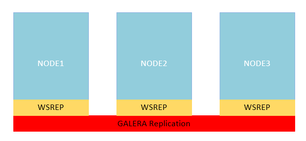

Cluster có 2 mode hoạt động là **Active - Passive** và **Active - Active**:

- **Active - Passive**: Tất cả các thao tác ghi sẽ được thực hiện ở máy chủ Active, sau đó sẽ được sao chép sang các máy chủ Passive. Các máy chủ Passive này sẽ sẵn sàng đảm nhiệm vai trò của máy chủ Active khi xảy ra sự cố. Trong một vài trường hợp, **Active - Passive** cho phép `SELECT` ở các máy chủ Passive.
- **Active - Active**: Thao tác đọc - ghi dữ liệu sẽ diễn ra ở mỗi node. Khi có thay đổi, dữ liệu sẽ được đồng bộ tới tất cả các node

Bài hướng dẫn dưới đây tôi sẽ cấu hình cho nó hoạt động ở mode **Active - Active**.

## 2. Chuẩn bị

### 2.1. Môi trường cài đặt
    root@node-1:~# cat /etc/os-release
    NAME="Ubuntu"
    VERSION="20.04.3 LTS (Focal Fossa)"
    ID=ubuntu
    ID_LIKE=debian
    PRETTY_NAME="Ubuntu 20.04.3 LTS"
    VERSION_ID="20.04"
    HOME_URL="https://www.ubuntu.com/"
    SUPPORT_URL="https://help.ubuntu.com/"
    BUG_REPORT_URL="https://bugs.launchpad.net/ubuntu/"
    PRIVACY_POLICY_URL="https://www.ubuntu.com/legal/terms-and-policies/privacy-policy"
    VERSION_CODENAME=focal
    UBUNTU_CODENAME=focal
    root@node-1:~#

### 2.2. Thiết lập IP cho các node
    node-1: 10.0.0.11
    node-2: 10.0.0.12
    node-3: 10.0.0.13
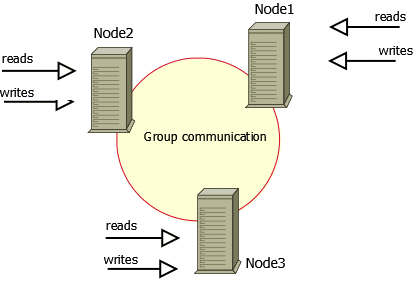

### Bước 1: Thực hiện cài đặt các packge all node
    apt update -y
    apt remove apparmor -y # Remove apparmor
    wget https://repo.percona.com/apt/percona-release_latest.generic_all.deb #Download Percona software repository
    dpkg -i ./percona-release_latest.generic_all.deb #Install Percona software repository

### Bước 2: Run the percona-release all node
    percona-release disable all
    percona-release setup pxc57
    percona-release enable tools release
    apt update -y

### Bước 3: Configures for easy access as root user all node
    touch /root/.my.cnf
    chmod 0400 /root/.my.cnf
    cat <<EOF>> /root/.my.cnf
    [client]
    user     = root
    password = 4E6fPwVY1@5TWERj2IRf
    EOF

### Bước 4: Install percona-server all node
    apt install percona-xtradb-cluster-full-57 python3-mysqldb automysqlbackup -y

### Bước 5: Nhập root password mysql all node
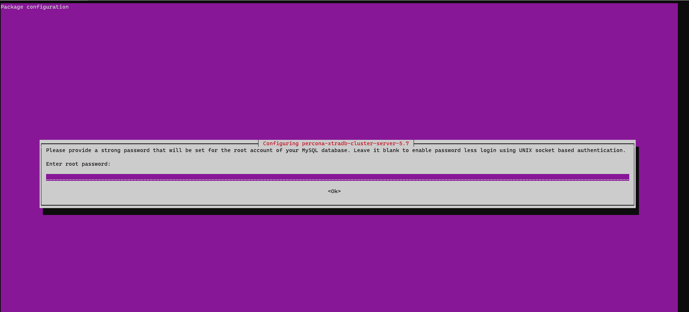

### Bước 6: Config wsrep galena mysql trên các node
    cp /etc/mysql/percona-xtradb-cluster.conf.d/wsrep.cnf /etc/mysql/percona-xtradb-cluster.conf.d/wsrep.cnf.org
    truncate -s 0 /etc/mysql/percona-xtradb-cluster.conf.d/wsrep.cnf
    cat <<EOF>>/etc/mysql/percona-xtradb-cluster.conf.d/wsrep.cnf
    [mysqld]
    datadir = /var/lib/mysql
    user = mysql
    default-time-zone = '+7:00'
    max_connections = 500
    #bind-address = 10.0.0.11 # Thay đổi IP đúng với từng node
    slow-query-log = /var/log/mysql/mysql-slow.log
    long_query_time = 2

    # UTF8
    default-storage-engine = innodb
    innodb_file_per_table = on
    collation-server = utf8_general_ci
    init-connect = 'SET NAMES utf8'
    character-set-server = utf8
    default-storage-engine = innodb
    innodb_file_per_table = on
    init-connect = 'SET NAMES utf8mb4'
    character-set-client-handshake = FALSE
    character-set-server = utf8mb4
    collation-server = utf8mb4_unicode_ci
    innodb_buffer_pool_size = 1G
    innodb_buffer_pool_instances = 4
    innodb_log_file_size = 128M
    innodb_flush_log_at_trx_commit = 2
    innodb_flush_method = O_DIRECT
    innodb_lru_scan_depth = 256
    innodb_io_capacity = 500
    innodb_io_capacity_max = 2000
    innodb_thread_concurrency = 0
    innodb_read_io_threads = 6
    innodb_write_io_threads = 6
    show_compatibility_56 = ON;
    max_allowed_packet = 1024M
    innodb_autoinc_lock_mode = 2
    pxc_strict_mode = DISABLED

    # Path to Galera library
    wsrep_provider = /usr/lib/galera3/libgalera_smm.so
    # Cluster connection URL contains IPs of node#1, node#2 and node#3
    wsrep_cluster_address = gcomm://10.0.0.11,10.0.0.12,10.0.0.13

    # In order for Galera to work correctly binlog format should be ROW
    binlog_format = ROW
    # MyISAM storage engine has only experimental support
    default_storage_engine = InnoDB
    # This changes how InnoDB autoincrement locks are managed and is a requirement for Galera
    innodb_autoinc_lock_mode = 2
    # Node #2 address
    wsrep_node_address = 10.0.0.11 # Thay đổi IP tương ứng từng node
    # Cluster name
    wsrep_cluster_name = Mysql_cluster_test 
    # SST method
    wsrep_sst_method = xtrabackup-v2
    #Authentication for SST method
    wsrep_sst_auth = "sstuser:QPrw3Qz0FpxrsF5XU7wI"
    EOF

### Bước 7: Stop mysql on all node
    /etc/init.d/mysql stop

### Bước 8: Bootstrap on master node
    /etc/init.d/mysql bootstrap-pxc
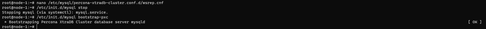

### Bước 9: Create sst user (thực hiện trên master node)
    mysql
    CREATE USER 'sstuser'@'%' IDENTIFIED BY 'QPrw3Qz0FpxrsF5XU7wI';
    GRANT RELOAD,LOCK TABLES,PROCESS,REPLICATION CLIENT ON *.* TO 'sstuser'@'%';
    FLUSH PRIVILEGES;
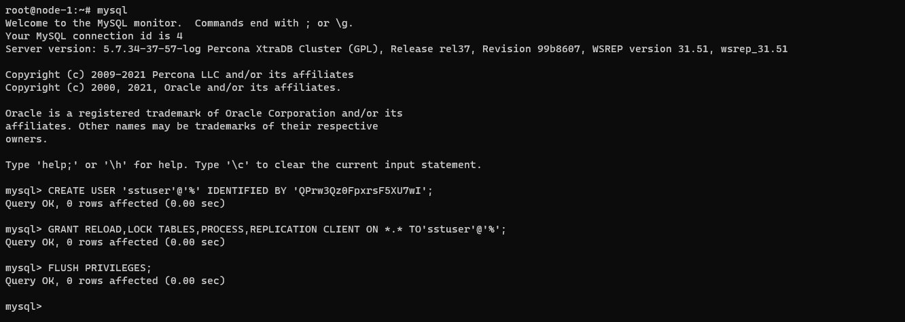

### Bước 10: Restart mysql on other nodes
    /etc/init.d/mysql restart

### **Giải thích một số config wsrep**
- wsrep_provider: Chỉ định đường dẫn đến thư viện Galera. Vị trí tuỳ thuộc vào hệ điều hành:
    * Debian/Ubuntu: /usr/lib/galera4/libgalera_smm.so
    * Red Hat/CentOS: /usr/lib64/galera4/libgalera_smm.so
- wsrep_cluster_address: Chỉ định địa chỉ IP của các node trong cụm cluster. Phải có ít nhất một node để tham gia vào cụm nhưng nên liệt kê tất cả địa chỉ IP của tất cả các node
- wsrep_node_address: Chỉ định địa chỉ node, thay đổi IP tương ứng từng node
- wsrep_cluster_name: Chỉ định tên cụm cluster. Tất cả các node trong cụm phải có tên giống nhau
- wsrep_sst_auth: Là thông tin về account mà các node sẽ dùng để thực hiện đồng bộ data

### 4. Kiểm tra sự đồng bộ dữ liệu của cluster

### Bước 1: Tạo database test_node_1 trên node-1:
    mysql
    create database test_node_1;
    use test_node_1
    create table user (c int);
    insert into user (c) values (1);
    select * from user;

### Bước 2: Tạo database test_node_2 trên node-2:
    mysql
    create database test_node_2;
    use test_node_2
    create table user2 (c int);
    insert into user2 (c) values (1);
    select * from user2;

### Bước 3: Tạo database test_node_3 trên node-3:
    mysql
    create database test_node_3;
    use test_node_3
    create table user3 (c int);
    insert into user3 (c) values (1);
    select * from user3;

### Bước 4: Check đồng bộ dữ liệu từ các node
    mysql
    show databases;
    use test_node_1
    select * from user;
    use test_node_2
    select * from user2;
    use test_node_3
    select * from user3;   

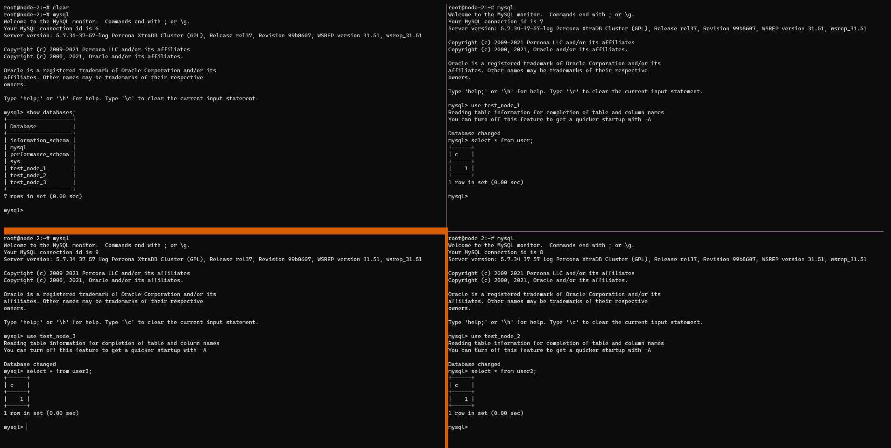
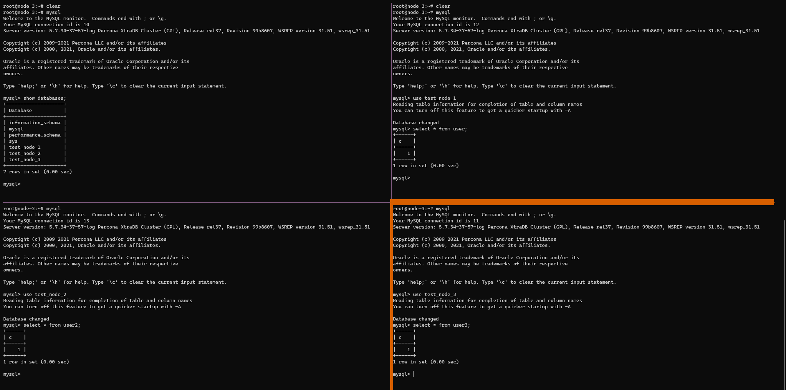

### Bước 5: Shutdown server node-1: 
    init 0

### Bước 6: Thực hiện tạo dữ liệu trên database test_node_3 trên node-3
    mysql
    use test_node_3
    create table tbl3 (col1 int);
    insert into tbl3 (col1) values (1000);
    select * from tbl3;

### Bước 7: Start lại server node-1 và check đồng bộ dữ liệu
    mysql
    use test_node_3
    select * from tbl3;
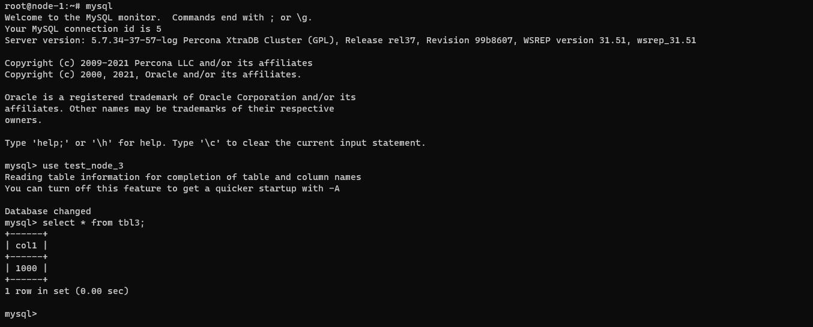

### Bước 8: Check logs trên node-2 hoặc node-3 để xem chi tiết
    less -f /var/log/mysqld.log

### 5. Cài đặt Maxscale Load balance cho các node mysql
**Maxscale là gì ?** Có hai mô hình cân bằng tải: lớp transport và lớp application. HAProxy là một cân bằng tải TCP tuyệt vời, nhưng nó lại có những hạn chế về khả năng của mình để giải quyết các vấn đề mở rộng quy mô nhất định trong môi trường cơ sở dữ liệu phân tán. Trong thế giới mã nguồn mở, có được một vài cân bằng tải cho SQL, cụ thể là MySQL Proxy, ProxySQL và MaxScale  

**MariaDB MaxScale** là thế hệ tiếp theo database proxy dùng để quản lý an ninh, khả năng mở rộng và tính sẵn sàng cao trong quá trình triển khai. Sử dụng MaxScale, quản lý các tiến trình cơ sở dữ liệu đang chạy mà không gây hại đến hoạt động của ứng dụng. Kiến trúc MariaDB MaxScale được thiết kế để tăng tính linh hoạt và tùy biến.

**Tại sao lại sử dụng MariaDB MaxScale?:**
- Bảo vệ cơ sở dữ liệu của bạn: MaxScale ngăn chặn các cuộc tấn công bảo mật như SQL injection và DDoS. Cơ sở dữ liệu sẽ luôn luôn là một mục tiêu cho tin tặc tìm cách để truy cập thông tin nhạy cảm. MaxScale giúp giảm thiểu truy cập không mong muốn và cung cấp các tính năng cơ sở dữ liệu tường lửa tiên tiến đảm bảo cơ sở dữ liệu của bạn ở mọi cấp độ.  
  * Hỗ trợ SSL end-to-end để truy cập dữ liệu an toàn
  * Ngăn chặn các cuộc tấn công SQL injection với whitelist và blacklist
  * Giảm thiểu các cuộc tấn công DDoS bằng cách cấu hình quy tắc tỷ lệ hạn chế
- Quản lý Scale-Out: Quản lý truy cập 1 cách tập trung. MaxScale là proxy cơ sở dữ liệu, cho phép mở rộng quy mô cơ sở dữ liệu theo chiều ngang trong trường hợp cần bảo trì hệ thống. MariaDB MaxScale cung cấp khả năng mở rộng transaction , khả năng mở rộng dữ liệu và mở rộng binlog thông qua:
  * Thời gian đáp ứng truy vấn nhanh hơn thông qua SQL-aware router
  * Sharding dữ liệu đơn giản với định tuyến truy vấn
  * Tăng thêm hiệu năng khi mở rộng với Binlog server
- Đảm bảo tính sẵn sàng cao: Giảm downtime, MaxScale tự động failover và đồng bộ.

**Cài đặt maxscale HA cho mysql maxscale IP**:10.0.0.14

### Bước 1: Tạo User maxscaleuser và Grant privileges
    mysql
    CREATE USER 'maxscaleuser'@'%' IDENTIFIED BY '0atvL0nqgmFVHpD3';
    GRANT SELECT ON mysql.user TO 'maxscaleuser'@'%';
    GRANT SELECT ON mysql.db TO 'maxscaleuser'@'%';
    GRANT SELECT ON mysql.tables_priv TO 'maxscaleuser'@'%';
    GRANT SELECT ON mysql.* TO 'maxscaleuser'@'%';
    GRANT SHOW DATABASES ON *.* TO 'maxscaleuser'@'%';
    GRANT REPLICATION CLIENT on *.* to 'maxscaleuser'@'%';
    FLUSH PRIVILEGES;

### Bước 2: Cài đặt maxscale 
    apt-update
    apt install curl -y
    curl -sS https://downloads.mariadb.com/MariaDB/mariadb_repo_setup | sudo bash
    apt install maxscale -y

### Bước 3: Config MaxScale
    cp /etc/maxscale.cnf /etc/maxscale.cnf_org
    truncate -s 0 /etc/maxscale.cnf 
    cat <<EOF>> /etc/maxscale.cnf 
    [maxscale]
    threads=auto
    syslog=1
    admin_host=0.0.0.0
    admin_secure_gui=false

    [mysql-node-1]
    type=server
    address=10.0.0.11
    port=3306
    protocol=MySQLBackend
    [mysql-node-2]
    type=server
    address=10.0.0.12
    port=3306
    protocol=MySQLBackend
    [mysql-node-3]
    type=server
    address=10.0.0.13
    port=3306
    protocol=MySQLBackend

    [MariaDB-Monitor]
    type=monitor
    module=mariadbmon

    servers=mysql-node-1,mysql-node-2,mysql-node-3
    user=maxscaleuser
    password=0atvL0nqgmFVHpD3
    monitor_interval=2000

    [Read-Write-Service]
    type=service
    router=readwritesplit
    servers=mysql-node-1,mysql-node-2,mysql-node-3
    user=maxscaleuser
    password=0atvL0nqgmFVHpD3

    [Read-Only-Service]
    type=service
    router=readconnroute
    servers=mysql-node-1,mysql-node-2,mysql-node-3
    user=maxscaleuser
    password=0atvL0nqgmFVHpD3
    router_options=slave

    [Read-Write-Listener]
    type=listener
    service=Read-Write-Service
    protocol=MariaDBClient
    address=0.0.0.0
    port=3306

    [Read-Only-Listener]
    type=listener
    service=Read-Only-Service
    protocol=MariaDBClient
    address=0.0.0.0
    port=3308
    EOF

### Bước 4: Start maxscale and check 
    systemctl restart maxscale
    systemctl status maxscale
    maxctrl list services
    maxctrl list servers
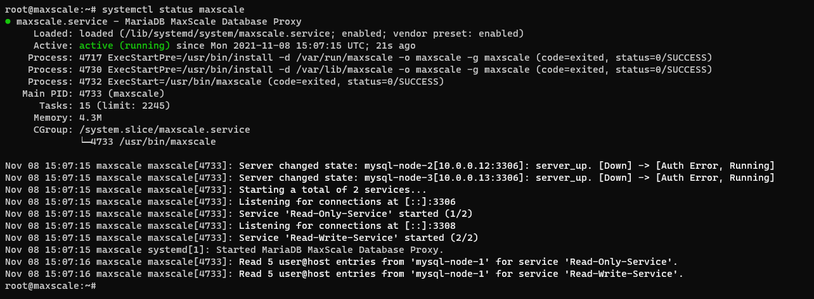
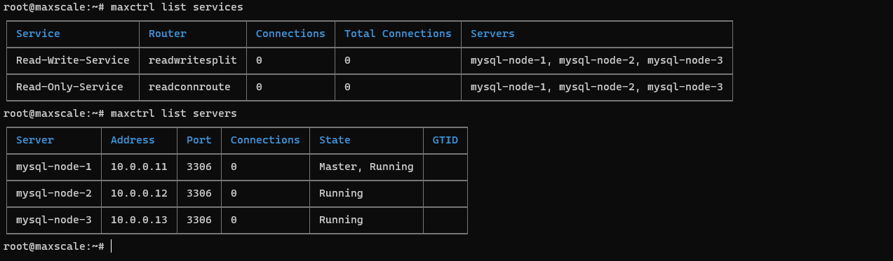

### Bước 5: Tiến hành connect với mysql cluster IP maxscale
    mysql -h 10.0.0.14 -umaxscaleuser -p0atvL0nqgmFVHpD3 -P3306 -e 'SELECT @@hostname;'
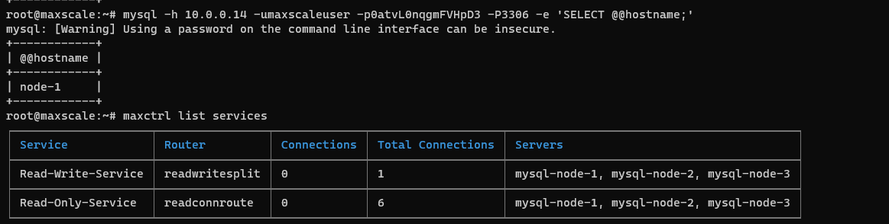
        
    

