# Chuẩn bị:
    - 2 server sử dụng OS CentOS
    - 2 ổ cứng có cùng dung lượng được gắn vào các node
# Node 1:
    OS: CentOS 7 64 bit
    Device: /dev/sdb - 10GB
    Hostname: pg-1
    IP: 10.0.0.11
# Node 2:
    OS: CentOS 7 64 bit
    Device: /dev/sdb - 10GB
    Hostname: pg-2
    IP: 10.0.0.11
# Các bước thực hiện
# Cài đặt postgresql-12 trên tất cả các node
    yum install https://download.postgresql.org/pub/repos/yum/reporpms/EL-7-x86_64/pgdg-redhat-repo-latest.noarch.rpm -y
    yum install postgresql12 postgresql12-server postgresql12-contrib postgresql12-libs -y
# Tạo file .bashrc trên user postgres
    su postgres 
    cd ~
    touch .bashrc 
    cat <<EOF >> .bashrc 
    # .bashrc
    # User specific aliases and functions
    alias rm='rm -i'
    alias cp='cp -i'
    alias mv='mv -i'
    # Source global definitions
    if [ -f /etc/bashrc ]; then
            . /etc/bashrc
    fi
    source ~/.bash_profile
    EOF
# Tạo file .bash_profile trên user postgres
    su postgres 
    cd ~
    rm -rf .bash_profile 
    touch .bash_profile 
    cat <<EOF >> .bash_profile
    [ -f /etc/profile ] && source /etc/profile
    PGDATA=/var/lib/pgsql/12/data
    export PGDATA
    export PATH="$PATH:/usr/pgsql-12/bin"
    export PS1="[\u@\h \W]\\$ "
    # If you want to customize your settings,
    # Use the file below. This is not overridden
    # by the RPMS.
    [ -f /var/lib/pgsql/.pgsql_profile ] && source /var/lib/pgsql/.pgsql_profile
    alias ssh='ssh -o StrictHostKeyChecking=no'
    alias scp='scp -o StrictHostKeyChecking=no'
    alias rsync='rsync -e "ssh -o StrictHostKeyChecking=no"'
    EOF
# Cài đặt Pacemaker và Corosync
    yum install -y pacemaker pcs fence-agents-all psmisc policycoreutils-python
# Cấu hình Cluster với Pacemaker và Corosync
- Trên cả 2 node, chúng ta đặt password cho user hacluster để xác thực với nhau, 2 mật khẩu phải trùng khớp

        echo "test_pg123" | passwd --stdin hacluster
- Khởi động dịch vụ trên cả 2 node:
        systemctl start pcsd
        systemctl enable pcsd
#  Xác thực 2 node với nhau trong cluster (Thực hiện trên node-1)
    pcs cluster auth pg-1 pg-2 -u hacluster -p test_pg123
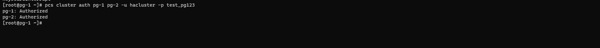 

# Tạo cluster để đồng bộ  (Thực hiện trên node-1)
    pcs cluster setup --name test_pg pg-1 pg-2
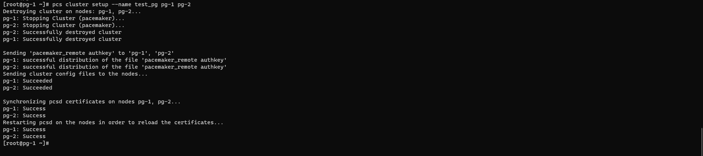 

# Khởi động và kích hoạt cluster (Thực hiện trên node-1)
    pcs cluster start --all
    pcs cluster enable --all
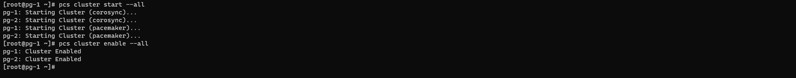 

# Check trạng thái cluster trên tất cả các node
    pcs status
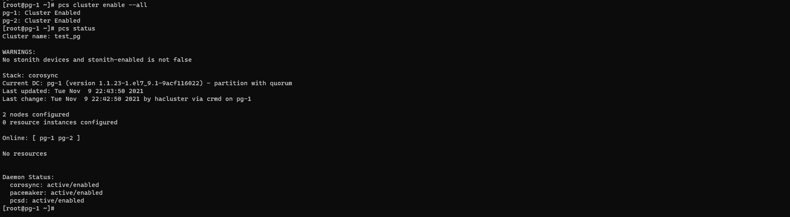 
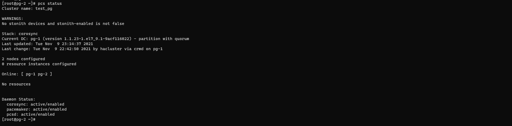 

# Tắt Quorum và STONITH (Thực hiện trên node-1)
    pcs property set stonith-enabled=false
    pcs property set no-quorum-policy=ignore

# Thiết lập cho các resource luôn hoạt động trên cùng một máy chủ (Thực hiện trên node-1)
    pcs property set default-resource-stickiness="INFINITY"
# Cài đặt DRDB trên tất cả các node
    rpm --import https://www.elrepo.org/RPM-GPG-KEY-elrepo.org
    rpm -Uvh http://www.elrepo.org/elrepo-release-7.0-2.el7.elrepo.noarch.rpm
    yum install -y kmod-drbd84 drbd84-utils
# Kích hoạt DRDB trên cả 2 node
    modprobe drbd
# Kiểm tra DRDB đã hoạt động hay chưa:
    lsmod | grep drbd
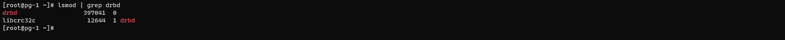 
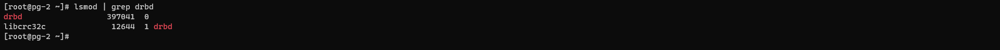 

# Cấu hình DRDB trên cả 2 node
    touch /etc/drbd.d/test_pg.res
    cat <<EOF>> /etc/drbd.d/test_pg.res
    resource test_pg {
    protocol C;        
    on pg-1 {
                    device /dev/drbd0;
                    disk /dev/vgdrbd/pgvloume;
                    address 10.0.0.11:7788;
                    meta-disk internal;
            }
    on pg-2 {
                    device /dev/drbd0;
                    disk /dev/vgdrbd/pgvloume;
                    address 10.0.0.12:7788;
                    meta-disk internal;
            }
    } 
    EOF
# Tạo LVM volume để lưu trữ thư mục postgresql data trên cả 2 node
    pvcreate /dev/sdb
    vgcreate vgdrbd /dev/sdb
    lvcreate -n pgvloume -l100%FREE vgdrbd
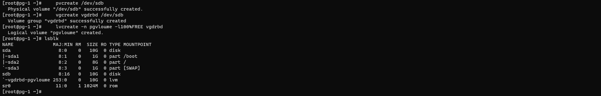 
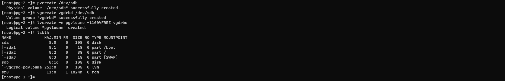 

# Khởi động DRDB meta-data storage trên cả 2 node
    drbdadm create-md test_pg
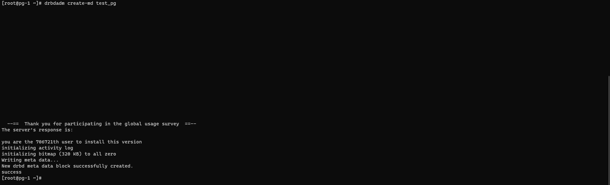 
 

# Khởi động DRBD
    systemctl start drbd
    systemctl enable drbd
# Chỉ định DRDB Primary node (Thực hiện trên node-1)
    drbdadm primary test_pg --force
# Kiểm tra kết quả quá trình đồng bộ
    cat /proc/drbd
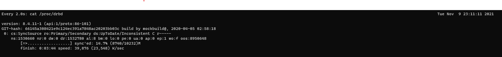 
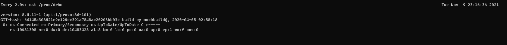 

# Tạo filesystem và mount vào thư mục chứa data postgresql
     mkfs.ext4 /dev/drbd0
     mount /dev/drbd0 /var/lib/pgsql/12/data/
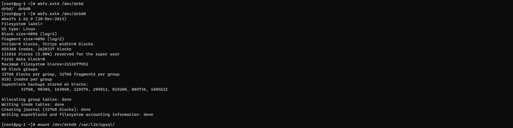

# Khởi tạo data postgresql trên node 1
    /usr/pgsql-12/bin/postgresql-12-setup initdb
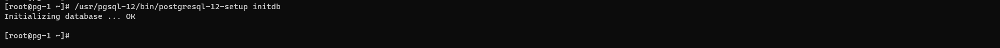

# Tạo cluster resource và đặt các thuộc tính
Tiếp đến, chúng ta tạo ra các tài nguyên như VIP, Httpd, DrbdData, DrbdDataClone, DrbdFS trên node1 để khi có yêu cầu sẽ bring up nó lên trên các node khác trong trường hợp có sự cố xảy ra:
- Tạo cho VIP: 10.0.0.10

        pcs resource create VirtIP ocf:heartbeat:IPaddr2 ip=10.0.0.10 cidr_netmask=32 op monitor interval=30
- Tạo cho dịch vụ postgresql

        pcs resource create p_pgsql ocf:heartbeat:pgsql op monitor interval=1min
- Tạo sự ràng buộc giữa pgsql và VIP

        pcs constraint colocation add p_pgsql with VirtIP INFINITY
        pcs constraint order VirtIP then p_pgsql
    

- Tạo sự thống nhất giữa tài nguyên DRBD trên các node: Khi một node1 đang Active, thì node2 ở chế độ Passive lưu trữ và đồng bộ dữ liệu từ node1. Để làm như vậy, chúng ta gộp tài nguyên ở 2 node bằng cấu hình CIB
    
        pcs cluster cib drbd_cfg
- Khai báo tài nguyên DRBD

        pcs -f drbd_cfg resource create DrbdData ocf:linbit:drbd drbd_resource=test_pg op monitor interval=60s
- Tạo bản sao tài nguyên DRBD: ản sao này cho phép tài nguyên có thể chạy trên các node cùng một thời điểm

        pcs -f drbd_cfg resource master DrbdDataClone DrbdData master-max=1 master-node-max=1 clone-max=2 clone-node-max=1 notify=true
- Commit config bên trên vào CIB chính

        pcs cluster cib-push drbd_cfg
- Kiểm tra trạng thái của các resource

        pcs status resources
    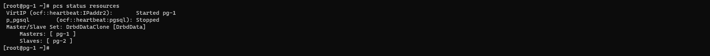
- Tạo tài nguyên filesystem DRBD

        pcs cluster cib fs_cfg
        pcs  -f fs_cfg resource create DrbdFS Filesystem device="/dev/drbd0" directory="/var/lib/pgsql" fstype="ext4"