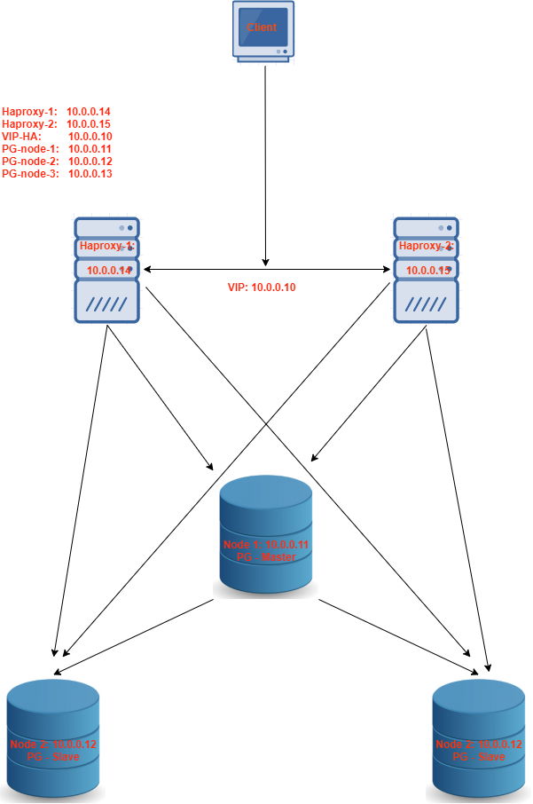

***Hướng dẫn cài đặt postgresql Auto Failover Repmgr ***  
### Menu
[1. Mô hình](#1)  
[2. Chuẩn bị ](#2)
- [2.1 Chuẩn bị môi trường](#2.1)
- [2.2 Thiết lập IP cho các node](#2.2)
- [2.3 Thiết lập hostname và sửa file /etc/hosts](#2.3) 

[3. Cài đặt postgresql](#3)
- [3.1 Cài đặt postgresql all node](#3.1)
- [3.2 Create  file .bashrc all node](#3.2)
- [3.2 Create file .bash_profile all node](#3.3) 
- [3.4 Create thư mục lưu log cho postgres](#3.4) 

[4. Config master node](#4)
- [4.1 Create data trên node master](#4.1)
- [4.2 Config postgresql trên master node](#4.2)
- [4.3 Config repmgr master node](#4.3)
- [4.4 Start service postgresql](#4.4)
- [4.5 Register the primary server](#4.5)

[5. Config node slave-1](#5)
- [5.1 Config repmgr node slave-1](#5.1)
- [5.2 Clone and register standby database to master](#5.2)

[6. Config node slave-1](#6)
- [6.1 Config repmgr node slave-1](#6.1)
- [6.2 Clone and register standby database to master](#6.2)

[7. Demo High Availability switch master](#7)
- [7.1 Manual](#7.1)
    - [Bước 1: shutdown node-1 check cluster trên node-2 và node-3](#7.1.1)  
    - [Bước 2: promote node-2 lên thành node master](#7.1.2)  
    - [Bước 3 : Đúng trên node-2 và node-3 check status cluster](#7.1.3)  
    - [Bước 4: Set node-3 follow standby node-2](#7.1.4)  
    - [Bước 5: Check lại trạng thái cluster](#7.1.5)  
    - [Bước 6: Rejoin cluster](#7.1.6)  
- [7.2 Auto switch master](#7.2)
    - [Bước 1: Kiểm tra trạng thái cluster và repmgr service](#7.2.1)  
    - [Bước 2: Start repmgr-96 trên tất cả các node](#7.2.2) 
    - [Bước 3: Check status repmgr ](#7.2.3)  
    - [Bước 4: Check trạng thái cluster: master: node-1, standby: node-2, node-3](#7.2.4) 
    - [Bước 5: Stop service postgresql-9.6 trên service node-1, check status cluster](#7.2.5)  
    - [Bước 6: Stop service postgresql-9.6 trên service node-2, check status cluster](#7.2.6) 
    - [Bước 7: Start lại server node-1, node-2 và join lại vào cluster](#7.2.7)  

[8. Install Haproxy loadblance](#8)
- [8.1 Install & Config trên các node-pg](#8.1)
- [8.2 Config haproxy](#8.2)
- [8.3 Check trạng thái backend trên UI](#8.3)

<a name="1"></a>
### 1. Mô hình


<a name="2"></a>
### 2. Chuẩn bị 
<a name="2.1"></a>
### 2.1. Chuẩn bị môi trường
```sh
[root@localhost ~]# cat /etc/os-release
NAME="CentOS Linux"
VERSION="7 (Core)"
ID="centos"
ID_LIKE="rhel fedora"
VERSION_ID="7"
PRETTY_NAME="CentOS Linux 7 (Core)"
ANSI_COLOR="0;31"
CPE_NAME="cpe:/o:centos:centos:7"
HOME_URL="https://www.centos.org/"
BUG_REPORT_URL="https://bugs.centos.org/"

CENTOS_MANTISBT_PROJECT="CentOS-7"
CENTOS_MANTISBT_PROJECT_VERSION="7"
REDHAT_SUPPORT_PRODUCT="centos"
REDHAT_SUPPORT_PRODUCT_VERSION="7"
```
<a name="2.2"></a>
### 2.2 Config IP cho các node
```sh
node-1: 10.0.0.11
node-2: 10.0.0.12
node-3: 10.0.0.13
```
<a name="2.3"></a>
# 2.3 Config hostname và /etc/hosts
```sh
cat <<EOF>> /etc/hosts
10.0.0.11 node-1
10.0.0.12 node-2
10.0.0.13 node-3
EOF
```
<a name="3"> </a>
### 3. Cài đặt postgresql
<a name="3.1"> </a>
### 3.1 Cài đặt postgresql all node
```sh
yum install https://download.postgresql.org/pub/repos/yum/reporpms/EL-7-x86_64/pgdg-redhat-repo-latest.noarch.rpm -y
yum install postgresql96 postgresql96-server postgresql96-contrib postgresql96-libs repmgr96 xinetd -y
ln -s /usr/pgsql-9.6/bin/repmgr /usr/bin/
ln -s /usr/pgsql-9.6/bin/pg_ctl /usr/bin/
```
<a name="3.2"> </a>
### 3.2 Create file .bashrc all node
```sh
su postgres && cd 
touch .bashrc 
cat <<EOF >> .bashrc 
# .bashrc
# User specific aliases and functions
alias rm='rm -i'
alias cp='cp -i'
alias mv='mv -i'
# Source global definitions
if [ -f /etc/bashrc ]; then
        . /etc/bashrc
fi
source ~/.bash_profile
EOF
```
<a name="3.3"> </a>
### 3.2 Create file .bash_profile all node
```sh
su postgres && cd 
touch .bash_profile 
cat <<EOF >> .bash_profile
[ -f /etc/profile ] && source /etc/profile
PGDATA=/var/lib/pgsql/9.6/data
export PGDATA
export PATH="$PATH:/usr/pgsql-9.6/bin"
export PS1="[\u@\h \W]\\$ "
# If you want to customize your settings,
# Use the file below. This is not overridden
# by the RPMS.
[ -f /var/lib/pgsql/.pgsql_profile ] && source /var/lib/pgsql/.pgsql_profile
alias ssh='ssh -o StrictHostKeyChecking=no'
alias scp='scp -o StrictHostKeyChecking=no'
alias rsync='rsync -e "ssh -o StrictHostKeyChecking=no"'
EOF
```
<a name="3.4"> </a>
### 3.4 Create folder lưu log cho postgres
```sh
mkdir /var/log/postgresql
chown -R postgres:postgres /var/log/postgresql
````
<a name="4"> </a>
### 4. Config master node
<a name="4.1"> </a>
### 4.1 Create data trên node master
    /usr/pgsql-9.6/bin/postgresql96-setup initdb
<a name="4.2"> </a>
### 4.2 Config postgresql trên master node 
-   Sửa các tham số sau trên file: /var/lib/pgsql/9.6/data/postgresql.conf  
    ```sh
    listen_addresses = '*'  
    shared_preload_libraries = 'repmgr'   
    wal_level = replica  
    wal_log_hints = on  
    archive_mode = on
    archive_command = 'cp %p /var/lib/pgsql/9.6/archives/%f'  
    max_wal_senders = 3  
    max_replication_slots = 2  
    hot_standby = on   
    log_checkpoints = on

    ```        
-   Config file /var/lib/pgsql/9.6/data/pg_hba.conf
    ```sh
    cat <<EOF>> /var/lib/pgsql/9.6/data/pg_hba.conf
    local   replication     repmgr                                  trust  
    host    replication     repmgr          127.0.0.1/32            trust  
    host    replication     repmgr          10.0.0.11/32            trust  
    host    replication     repmgr          10.0.0.12/32            trust  
    host    replication     repmgr          10.0.0.13/32            trust  
    host    replication     repmgr          10.0.0.14/32            trust  
    local   repmgr          repmgr                                  trust  
    host    repmgr          repmgr          127.0.0.1/32            trust  
    host    repmgr          repmgr          10.0.0.11/32            trust  
    host    repmgr          repmgr          10.0.0.12/32            trust  
    host    repmgr          repmgr          10.0.0.13/32            trust  
    host    repmgr          repmgr          10.0.0.14/32            trust
    EOF 
    ```
<a name="4.3"> </a>
### 4.3 Config repmgr master node 

-   Config file /etc/repmgr/9.6/repmgr.conf
    ```sh
    cp /etc/repmgr/9.6/repmgr.conf /etc/repmgr/9.6/repmgr.conf_org
    truncate -s 0 /etc/repmgr/9.6/repmgr.conf
    cat <<EOF>> /etc/repmgr/9.6/repmgr.conf
    cluster='pg_cluster'
    node_id=1
    node_name=node-1
    conninfo='host=10.0.0.11  user=repmgr dbname=repmgr connect_timeout=2'
    data_directory='/var/lib/pgsql/9.6/data'
    failover=automatic
    reconnect_attempts=3
    reconnect_interval=5
    promote_command='/usr/pgsql-9.6/bin/repmgr standby promote --log-to-file'
    follow_command='/usr/pgsql-9.6/bin/repmgr standby follow --log-to-file --upstream-node-id=%n'
    log_file='/var/log/repmgr/repmgrd-9.6.log'
    event_notifications='standby_promote'
    pg_bindir='/usr/pgsql-9.6/bin/'
    EOF
    ```
<a name="4.4"> </a>
### 4.4 Start service postgresql
```sh
systemctl start postgresql-9.6
```    
<a name="4.5"> </a>   
### 4.5 Register the primary server
```sh
su postgres
createuser -s repmgr
createdb repmgr -O repmgr
repmgr primary register 
repmgr cluster show
```
  

<a name="5"></a>
### 5. Config node slave-1
<a name="5.1"> </a>
### 5.1 Config repmgr node slave-1
-   Config file /etc/repmgr/9.6/repmgr.conf
    ```sh
    cp /etc/repmgr/9.6/repmgr.conf /etc/repmgr/9.6/repmgr.conf_org
    truncate -s 0 /etc/repmgr/9.6/repmgr.conf
    cat <<EOF>> /etc/repmgr/9.6/repmgr.conf
    cluster='pg_cluster'
    node_id=2
    node_name=node-2
    conninfo='host=10.0.0.12  user=repmgr dbname=repmgr connect_timeout=2'
    data_directory='/var/lib/pgsql/9.6/data'
    failover=automatic
    reconnect_attempts=3
    reconnect_interval=5
    promote_command='/usr/pgsql-9.6/bin/repmgr standby promote --log-to-file'
    follow_command='/usr/pgsql-9.6/bin/repmgr standby follow --log-to-file --upstream-node-id=%n'
    log_file='/var/log/repmgr/repmgrd-9.6.log'
    event_notifications='standby_promote'
    pg_bindir='/usr/pgsql-9.6/bin/'
    EOF
    ```
<a name="5.2"> </a>
### 5.2 Clone  and register standby database to master
-   Clone database từ node master
    ```sh
    repmgr -h 10.0.0.11  -U repmgr -d repmgr standby clone
    ```
-   Restart serive postgres  
    ```sh
    [root@node-2~] systemctl restart postgresql-9.6
    ```
- Register standby cluster
    ```sh
    repmgr standby register
    ```
- Check status cluster
    ```sh
    repmgr cluster show
    ```
      

<a name="6"></a>
### 6. Config node slave-2
<a name="6.2"></a>
### 6.1 Config repmgr node slave-2
-   Config file /etc/repmgr/9.6/repmgr.conf
    ```sh
    cp /etc/repmgr/9.6/repmgr.conf /etc/repmgr/9.6/repmgr.conf_org
    truncate -s 0 /etc/repmgr/9.6/repmgr.conf
    cat <<EOF>> /etc/repmgr/9.6/repmgr.conf
    cluster='pg_cluster'
    node_id=3
    node_name=node-3
    conninfo='host=10.0.0.13  user=repmgr dbname=repmgr connect_timeout=2'
    data_directory='/var/lib/pgsql/9.6/data'
    failover=automatic
    reconnect_attempts=3
    reconnect_interval=5
    promote_command='/usr/pgsql-9.6/bin/repmgr standby promote --log-to-file'
    follow_command='/usr/pgsql-9.6/bin/repmgr standby follow --log-to-file --upstream-node-id=%n'
    log_file='/var/log/repmgr/repmgrd-9.6.log'
    event_notifications='standby_promote'
    pg_bindir='/usr/pgsql-9.6/bin/'
    EOF
    ```
<a name="6.2"></a>
### 6.2.Clone  and register standby database tu node master
-   Clone database từ node master
    ```sh
    repmgr -h 10.0.0.11  -U repmgr -d repmgr standby clone
    ```
-   Restart serive postgres  
    ```sh
    [root@node-3~] systemctl restart postgresql-9.6
    ```
-   Register standby cluster
    ```sh
    repmgr standby register
    ```
-   Check status cluster
    ```sh
    repmgr cluster show
    ```
      

<a name="7"></a> 
### 7. Demo High Availability switch master
<a name="7.1"></a>
### 7.1 Manual
<a name="7.1.1"></a>
-   Bước 1: shutdown node-1 check cluster trên node-2 và node-3
      
      

<a name="7.1.2"></a>
-   Bước 2: promote node-2 lên thành node master
    ```sh
    repmgr standby promote
    ```
      

<a name="7.1.3"></a>
-   Bước 3 : Đúng trên node-2 và node-3 check status cluster
      
      
<a name="7.1.4"></a>
-   Bước 4: Set node-3 follow standby node-2
    ```sh
    repmgr standby follow
    ```
     

<a name="7.1.5"></a>
-   Bước 5: Check lại trạng thái cluster
    ```sh
    repmgr cluster show
    ```
     

<a name="7.1.6"></a>
-   Bước 6: Rejoin cluster
    -   Check status cluster trên node-2 hoặc node-3
        ```sh
        repmgr cluster show
        ```
         

    -   Stop service postgresql trên node-1
        ```sh
        [root@node-1~] systemctl stop postgresql-9.6
        ```
    -   Rejoin cluster
        ```sh
        repmgr node rejoin -d 'host=node-2 dbname=repmgr user=repmgr' \
        --force-rewind \
        --config-files=postgresql.local.conf,postgresql.conf \
        --verbose
        ```
         
    -   Check lại trạng thái cluster
        ```sh
        repmgr standby follow
        ```
        

<a name="7.2"></a>
### 7.2 Auto switch master
<a name="7.2.1"></a>
-   Bước 1: Check status cluster và repmgr service
    ```sh
    repmgr cluster show
    repmgr service status
    ```
    
<a name="7.2.2"></a>
-   Bước 2: Start repmgr-96 all nodes:
    ```sh
    systemctl restart repmgr-96.service
    systemctl enable repmgr-96.service
    ```
<a name="7.2.3"></a>
-   Bước 3: Check status repmgr   
    ```sh
    repmgr  service status
    ```
    
<a name="7.2.4"></a>
-   Bước 4: Check status cluster: master: node-1, standby: node-2, node-3
    ```sh
    repmgr  cluster show
    ```
    
<a name="7.2.5"></a>
-   Bước 5: Stop service postgresql-9.6 trên service node-1, check status cluster
    ```sh
    systemctl stop postgresql-9.6
    repmgr cluster show
    ```
-   Node-2 đã switch thành master, node-3 đã uptream theo new master
    

<a name="7.2.6"></a>
-   Bước 6: Stop service postgresql-9.6 trên service node-2, check status cluster
    ```sh        
    systemctl stop postgresql-9.6
    repmgr cluster show
    ```
-   Node-3 đã switch thành master
       

<a name="7.2.7"></a>
-   Bước 7: Start lại server node-1, node-2 và join lại vào cluster
    -   Stop service postgresql trên node-1, node-2:
        ```sh
        systemctl stop postgresql-9.6
        ```
    -   Rejoin cluster:
        ```sh
        repmgr node rejoin -d 'host=node-3 dbname=repmgr user=repmgr' \
        --force-rewind \
        --config-files=postgresql.local.conf,postgresql.conf \
        --verbose
        ```
         
    -   Check lại trạng thái cluster
        ```sh
        repmgr cluster show
        ```
          


<a name="8"></a>
### 8. Cài đặt Haproxy loadblance
<a name="8.1"></a>
### 8.1 Install & Config trên các node-pg
-   Install xinetd package
    ```sh
    yum install xinetd -y
    ```
-   Create file confg xinetd check service postgres
    ```sh
    touch /etc/xinetd.d/postgreschk
    cat <<EOF>> /etc/xinetd.d/postgreschk
    # default: on
    # description: postgreschk
    service postgreschk
    {
            flags           = REUSE
            socket_type     = stream
            port            = 9201
            wait            = no
            user            = root
            server          = /usr/local/sbin/postgreschk
            log_on_failure  += USERID
            disable         = no
            #only_from       = 0.0.0.0/0
            only_from       = 0.0.0.0/0
            per_source      = UNLIMITED
    }
    EOF
    ```
-   Add service check port postgres
    ```sh  
    echo "postgreschk        9201/tcp" >> /etc/services
    ```
-   Create script check service postgres
    ```sh
    touch /usr/local/sbin/postgreschk
    chmod +x /usr/local/sbin/postgreschk
    cat <<EOF>> /usr/local/sbin/postgreschk
    #!/bin/bash
    #
    # This script checks if a PostgreSQL server is healthy running on localhost. It will
    # return:
    # "HTTP/1.x 200 OK\r" (if postgres is running smoothly)
    # - OR -
    # "HTTP/1.x 500 Internal Server Error\r" (else)
    #
    # The purpose of this script is make haproxy capable of monitoring PostgreSQL properly
    #

    export PGHOST='10.0.0.11' # Doi IP cua tung node
    export PGUSER='repmgr'
    export PGPASSWORD='1'
    export PGPORT='5432'
    export PGDATABASE='repmgr'
    export PGCONNECT_TIMEOUT=10

    FORCE_FAIL="/dev/shm/proxyoff"

    SLAVE_CHECK="SELECT pg_is_in_recovery()"
    WRITABLE_CHECK="SHOW transaction_read_only"

    return_ok()
    {
        echo -e "HTTP/1.1 200 OK\r\n"
        echo -e "Content-Type: text/html\r\n"
        if [ "$1x" == "masterx" ]; then
            echo -e "Content-Length: 56\r\n"
            echo -e "\r\n"
            echo -e "<html><body>PostgreSQL master is running.</body></html>\r\n"
        elif [ "$1x" == "slavex" ]; then
            echo -e "Content-Length: 55\r\n"
            echo -e "\r\n"
            echo -e "<html><body>PostgreSQL slave is running.</body></html>\r\n"
        else
            echo -e "Content-Length: 49\r\n"
            echo -e "\r\n"
            echo -e "<html><body>PostgreSQL is running.</body></html>\r\n"
        fi
        echo -e "\r\n"

        unset PGUSER
        unset PGPASSWORD
        exit 0
    }

    return_fail()
    {
        echo -e "HTTP/1.1 503 Service Unavailable\r\n"
        echo -e "Content-Type: text/html\r\n"
        echo -e "Content-Length: 48\r\n"
        echo -e "\r\n"
        echo -e "<html><body>PostgreSQL is *down*.</body></html>\r\n"
        echo -e "\r\n"

        unset PGUSER
        unset PGPASSWORD
        exit 1
    }

    if [ -f "$FORCE_FAIL" ]; then
        return_fail;
    fi

    # check if in recovery mode (that means it is a 'slave')
    SLAVE=$(/usr/pgsql-9.6/bin/psql -qt -c "$SLAVE_CHECK" 2>/dev/null)
    if [ $? -ne 0 ]; then
        return_fail;
    elif echo $SLAVE | egrep -i "(t|true|on|1)" 2>/dev/null >/dev/null; then
        return_ok "slave"
    fi

    # check if writable (then we consider it as a 'master')
    READONLY=$(/usr/pgsql-9.6/bin/psql -qt -c "$WRITABLE_CHECK" 2>/dev/null)
    if [ $? -ne 0 ]; then
        return_fail;
    elif echo $READONLY | egrep -i "(f|false|off|0)" 2>/dev/null >/dev/null; then
        return_ok "master"
    fi

    return_ok "none";
    EOF
    ```
<a name="8.2"></a>

### 8.2 Config haproxy
-   Create file config haproxy
    ```sh
    cp /etc/haproxy/haproxy.cfg /etc/haproxy/haproxy.cfg_org
    truncate -s 0 /etc/haproxy/haproxy.cfg
    cat <<EOF>> /etc/haproxy/haproxy.cfg
    global
        pidfile /var/run/haproxy.pid
        daemon
        user haproxy
        group haproxy
        stats socket /var/run/haproxy.socket user haproxy group haproxy mode 600 level admin
        node haproxy_haproxy-pg
        description haproxy server

        #* Performance Tuning
        maxconn 8192
        spread-checks 3
        quiet
    defaults
        #log    global
        mode    tcp
        option  dontlognull
        option tcp-smart-accept
        option tcp-smart-connect
        #option dontlog-normal
        retries 3
        option redispatch
        maxconn 8192
        timeout check   3500ms
        timeout queue   3500ms
        timeout connect 3500ms
        timeout client  10800s
        timeout server  10800s

    userlist STATSUSERS
        group admin users admin
        user admin insecure-password admin
        user stats insecure-password admin

    listen admin_page
        bind *:9600
        mode http
        stats enable
        stats refresh 60s
        stats uri /
        acl AuthOkay_ReadOnly http_auth(STATSUSERS)
        acl AuthOkay_Admin http_auth_group(STATSUSERS) admin
        stats http-request auth realm admin_page unless AuthOkay_ReadOnly
        #stats admin if AuthOkay_Admin

    listen  haproxy_haproxy-pg_5433_rw_rw
        bind *:5433
        mode tcp
        timeout client  10800s
        timeout server  10800s
        tcp-check connect port 9201
        tcp-check expect string master\ is\ running
        balance leastconn
        option tcp-check
    #   option allbackups
        default-server port 9201 inter 2s downinter 5s rise 3 fall 2 slowstart 60s maxconn 64 maxqueue 128 weight 100
        server 10.0.0.11 10.0.0.11:5432 check
        server 10.0.0.12 10.0.0.12:5432 check
        server 10.0.0.13 10.0.0.13:5432 check


    listen  haproxy_haproxy-pg_5434_ro
        bind *:5434
        mode tcp
        timeout client  10800s
        timeout server  10800s
        tcp-check connect port 9201
        tcp-check expect string is\ running
        balance leastconn
        option tcp-check
    #   option allbackups
        default-server port 9201 inter 2s downinter 5s rise 3 fall 2 slowstart 60s maxconn 64 maxqueue 128 weight 100
        server 10.0.0.11 10.0.0.11:5432 check
        server 10.0.0.12 10.0.0.12:5432 check
        server 10.0.0.13 10.0.0.13:5432 check
    EOF
    ```
-   Restart service haproxy
    ```sh
    systemctl restart haproxy
    ```
<a name="8.3"> </a>
### 8.3 Check trạng thái backend trên UI
-   Check trạng thái backend trên dashboard:
    -   Url: http://10.0.0.14:9600/ 
    -   User/pass: admin/admin
 

> Refer:  
    -   https://www.postgresql.org/docs/  
    -   https://repmgr.org/docs/repmgr.html  
    -   https://www.percona.com/blog/2019/11/08/configure-haproxy-with-postgresql-using-built-in-pgsql-check/